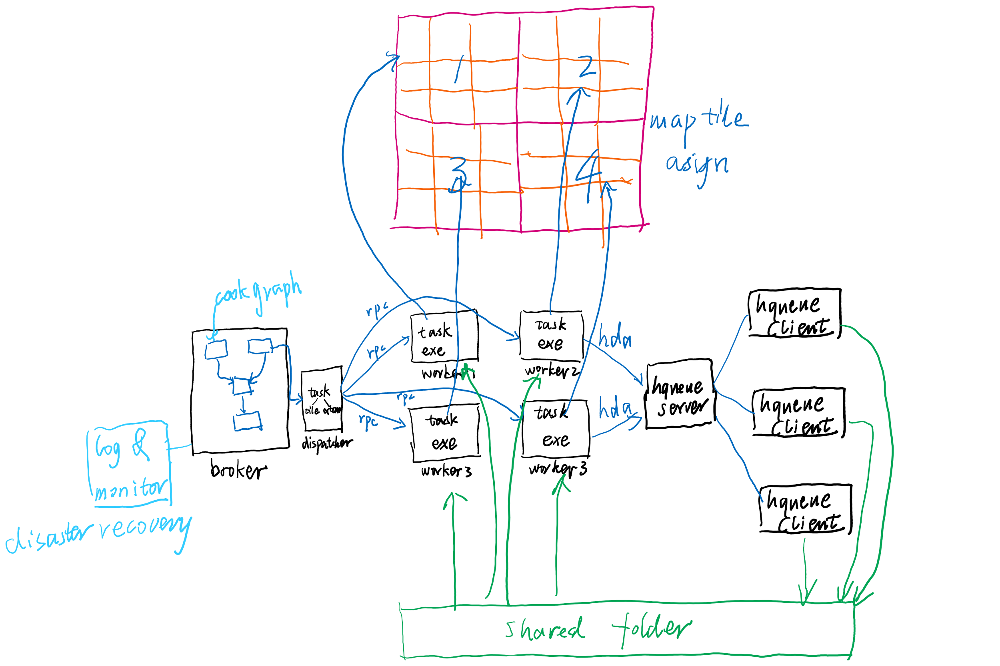

# 多机构建

同事又要开始造轮子了，看这图感觉PDG也能搞，所以不知道自己造轮子有什么劲儿，可能程序员什么都想自己来吧，就像米哈游那面试官说的，houdini对他们来说是个黑盒，他们想要控制权。哎，陪着玩吧。

游戏的多机构建跟影视的渲染任务没什么区别，只不过游戏里一个工具被当作一个项目，工具里的atom（线段）或者tile，当作是一个个shot，电影的渲染任务就很简单了，一个个排下就好了，依次渲染。按理说游戏任务也一样好了，但是游戏任务通常cook时间很短，加载任务时间很长！这导致频繁的调动任务可能在非cook的时间消耗会很大。按这张图的意思，应该是把数据提前分配好，比如100个shots（atom），20个shot（atom）作为一个task，这就打包好了5个tasks。然后将这5个tasks依次发送给渲染机器。所以多机构建的主要难题就变成了，如何高效的打包任务。

如何打包任务，就比如说植被工具吧，常规方式下它按照tile依次cook，在PDG下是可以一次性并发好多个任务，在多机状态下需要将440个tile分成比如10个任务，按照上图的意思应该是以position为依据，那就是一个任务44个tile，这会出现什么问题呢，任务的cook繁重程度不一样，有一些任务可能大部分地块属于海洋，没什么植被，那就很快cook完了，但是创建任务的时间比cook时间多很多，那就这部分创建任务的时间其实是浪费掉的，所以按照position分数据不是一个均衡负载好的方案。

另一个问题是，虽然同一个工具的数据间是没有耦合的，但是工具与工具是有强耦合的，工具A跑不完，是没办法跑工具B的。。这就很蛋疼了，可能出现二台机器在等另一台机器的情况！

所以最稳妥的方案应该是什么呢？使用PDG!

