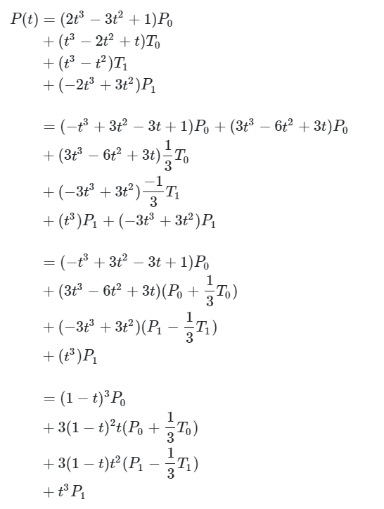
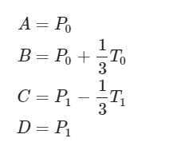
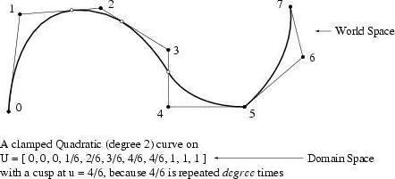
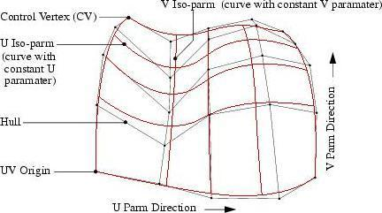

# 对齐unreal和Houdini的spline

## Unreal Spline类型以及于Cube Beizer转换
首先需要确定unreal的spline component使用的是哪种类型的曲线，是Bezier,Cubic Hermite还是Catmull-Rom。控制点的切线之间的数学关系是什么，他们如何影响曲线的？从USplineComponent源码中发现是通过以下方式计算FMath::CubicInterp
```c++
/**
 * Performs a cubic interpolation
 *
 * @param  P - end points
 * @param  T - tangent directions at end points
 * @param  Alpha - distance along spline
 *
 * @return  Interpolated value
 */
template< class T, class U > 
static FORCEINLINE_DEBUGGABLE T CubicInterp( const T& P0, const T& T0, const T& P1, const T& T1, const U& A )
{
    const float A2 = A  * A;
    const float A3 = A2 * A;

    return (T)
           (((2*A3)-(3*A2)+1) * P0)
         + ((A3-(2*A2)+A) * T0)
         + ((A3-A2) * T1)
         + (((-2*A3)+(3*A2)) * P1);
}
```

上面的计算方法和Cubic Hermite一样：

>p(t)=(2t3−3t2+1)p0+(t3−2t2+t)m0+(−2t3+3t2)p1+(t3−t2)m1

**可以确定的是spline component是Cubic Hermite类型的曲线。**

为了匹配cubic Bezier，需要将公式重新分解：



我们将得到四个控制点是



可以看出只需要切线乘以3就可以匹配cubic Bezier的公式。反推依然，cubic bezier的切线除以3即可得到unreal spline。所以本质上cubic bezier和cubic hermite是一样的。

## Houdini 支持什么类型的曲线
houdini primitive目前支持Bezier和NURBS曲线。

* NUPBS是Non-Uniform Rational B-Spline的首字母缩写。NUPBS是由控制点（CV）定义的平滑曲线和曲面。[参见维基百科定义](https://en.wikipedia.org/wiki/Non-uniform_rational_B-spline)






## 使用python在unreal中创建spline component

首先查到spline component的python 模块。

[unreal.SplineComponent](https://docs.unrealengine.com/5.0/en-US/PythonAPI/class/SplineComponent.html)

里面有个add_point(point, update_spline=True)方法，参数是输入一个SplinePoint。
```add_point(point, update_spline=True) → None
Adds an FSplinePoint to the spline. This contains its input key, position, tangent, rotation and scale.

Parameters
point (SplinePoint) –

update_spline (bool) –
```

构建SplinePoint初始化
```
class unreal.SplinePoint(input_key=0.0, position=[0.0, 0.0, 0.0], arrive_tangent=[0.0, 0.0, 0.0], leave_tangent=[0.0, 0.0, 0.0], rotation=[0.0, 0.0, 0.0], scale=[1.0, 1.0, 1.0], type=SplinePointType.CURVE)
```

可以尝试下创建2个点，position分别是[100,0,0],[0,100,0]，arrive_tangent和leave_tangent代表的是point的手柄的两个朝向。其他参数暂且为默认。

```python
import unreal

class spline():
    def __init__(self,spline_actor):
        self.spline_actor = spline_actor
        self.spline_component = spline_actor.get_component_by_class(unreal.SplineComponent)

    def clean(self):
        self.spline_component.clear_spline_points()

    def buildNewPoint(self,point):
        self.spline_component.add_point(point)


def selectActor():
    ELL = unreal.EditorLevelLibrary
    actors = ELL.get_selected_level_actors()

    for actor in actors:
        spline_actor = spline(actor)
        spline_actor.clean()
        input_key=0
        p0 = unreal.SplinePoint(input_key)
        p0.position = unreal.Vector(0,0,0)
        p0.arrive_tangent = unreal.Vector(0,100,0)
        p0.leave_tangent = unreal.Vector(0,100,0)
        p0.type = unreal.SplinePointType.CURVE_CUSTOM_TANGENT
        spline_actor.buildNewPoint(p0)

        input_key=1
        p1 = unreal.SplinePoint(input_key)
        p1.position = unreal.Vector(100,0,0)
        p1.arrive_tangent = unreal.Vector(0,-100,0)
        p1.leave_tangent = unreal.Vector(0,-100,0)
        p1.type = unreal.SplinePointType.CURVE_CUSTOM_TANGENT
        spline_actor.buildNewPoint(p1)     

selectActor()
```


https://forums.unrealengine.com/t/question-to-developers-which-algorithm-is-used-for-spline-components-in-ue4/42138/3

https://gamedev.stackexchange.com/questions/179400/how-to-convert-unreal-engine-4-spline-to-a-bezier-curve

https://en.wikipedia.org/wiki/B%C3%A9zier_curve

https://forums.unrealengine.com/t/which-algorithm-is-used-for-spline-components-in-ue4/337817

https://www.sidefx.com/docs/houdini/model/primitives.html#:~:text=In%20Houdini%2C%20primitives%20refer%20to,and%20Packed%20Disk%20Sequence%20primitives